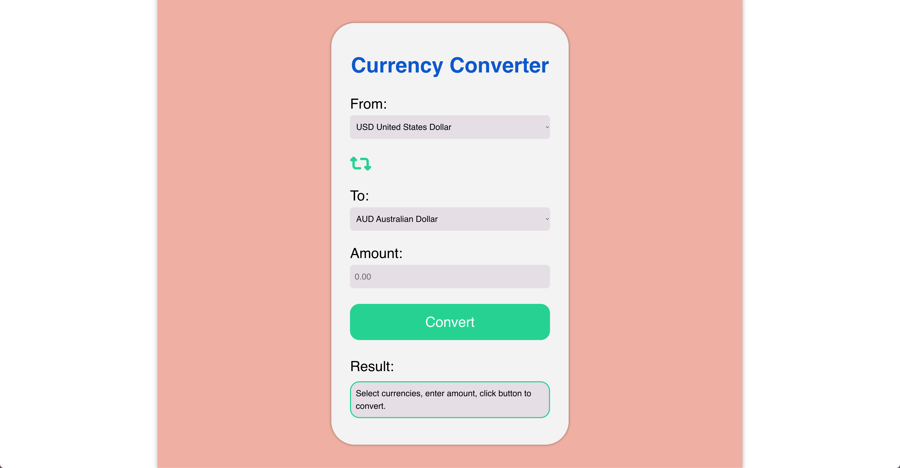
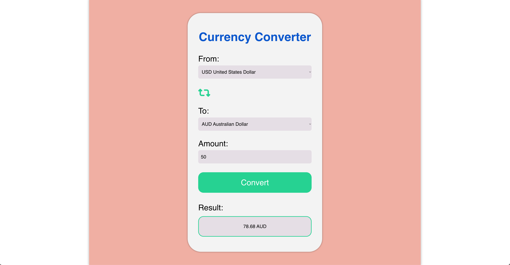

# Currency Converter App

This is a simple currency converter web application built using Node.js, Express.js, and EJS for server-side rendering. It allows users to convert between different currencies using real-time exchange rates from the Frankfurter API.  The app is also responsive, adapting to different screen sizes.

## Features

*   Converts between a wide range of currencies.
*   Displays real-time exchange rates.
*   User-friendly and responsive interface, adapting to various screen sizes (desktop, tablet, and mobile).
*   Handles errors gracefully.
*   Includes a swap button to easily reverse the conversion direction.
*   Formats converted amount with commas for thousands separators.

## Technologies Used

*   Node.js
*   Express.js
*   EJS (Embedded JavaScript)
*   Frankfurter API ([https://api.frankfurter.dev/v1/](https://api.frankfurter.dev/v1/))
*   Axios (for making HTTP requests)
*   Font Awesome (for icons)
*   CSS Media Queries (for responsiveness)

## Screenshots

### Before Conversion (Desktop)



### After Conversion (Desktop)



## Getting Started

1.  **Clone the repository:**

    ```bash
    git clone [https://github.com/](https://github.com/)Hamish404/Currency-Converter-App.git
    ```

2.  **Navigate to the project directory:**

    ```bash
    cd Currency-Converter-App
    ```

3.  **Install dependencies:**

    ```bash
    npm install
    ```

4.  **Run the application:**

    ```bash
    node index.js
    ```

5.  **Open in your browser:**

    Go to `http://localhost:3000` in your web browser.

## Usage

1.  Select the currency you want to convert from in the "From" dropdown.
2.  Select the currency you want to convert to in the "To" dropdown.
3.  Enter the amount you want to convert in the "Amount" field.
4.  Click the "Convert" button.
5.  The converted amount will be displayed in the "Result" section.
6.  Use the swap button to quickly reverse the conversion direction.

## Responsiveness

The application is designed to be responsive and adapts to different screen sizes using CSS media queries.  It provides an optimal viewing experience on desktops, tablets, and mobile devices.

## Error Handling

The application handles various errors, such as invalid input or API request failures, and displays appropriate error messages to the user.
